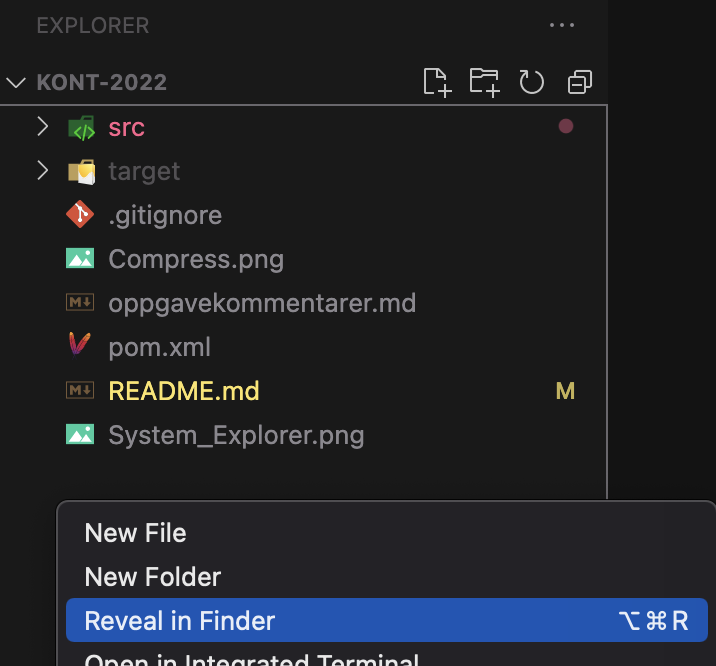

# Kont-eksamen, "sommer" 2022

Oppgaven består av følgende deler, som ligger inne i hver sin pakke.

-   [Del 1](src/main/java/part1/part1.md)
-   [Del 2](src/main/java/part2/part2.md)
-   [Del 3](src/main/java/part3/part3.md)

## Oppgaveformat

Oppgavebeskrivelsene finner dere under hver del. Det vil si src/main/java/part1/part1.md inneholder oppgavebeskrivelsen for del 1.

Rollen til de ulike klassene skisseres først, før selve oppgaveteksten.
Alle klassene er ferdig opprettet, og kan inneholde både ferdiglagde metoder og metoder dere skal fylle inn.
Det er markert med TODO-kommentarer hvor dere må må fylle inn egen kode.
Evt. **return**-setninger er med for å unngå kompileringsfeil, og må også endres.
Merk at det kan være nødvendig å legge til annen kode også, avhengig av valg dere selv tar.
Noen av klassene har main-metoder, som er ment å hjelpe dere å teste klassene manuelt.
Ytterligere informasjon kan stå i javadoc-en, som er kommentarer som står før klassedeklarasjonen og metodene i kildekoden.
Det er generelt lurt å se gjennom klassene for å få oversikt hva som er implementert ferdig og hva som mangler!

Dere kan bruke .md-filene til å navigere til riktige filer/klasser som faktisk skal implementeres.
Dersom du mener at javadoc og oppgavebeskrivelse inneholder motstridende informasjon, så gjør en kommentar om dette i [oppgavekommentarer](oppgavekommentarer.md) og
utfør oppgaven slik du mener gir best mening.

Et web-view av Java-docen kan og bli sett ved å åpne filen doc/index.html.

Hvis du ikke skulle klare å implementere en metode i en del kan du selvfølgelig bruke denne videre som om den virket (som i tidligere 'papireksamener').
Merk at metoden bør fortsatt kompilere, alle metoder kompilerer ved hjelp av _dummy_ return verdier, som er verdier av riktig type, men ikke korrekte.

Kode som ikke kompilerer vil gi trekk.

Unntak i koden som NullPointerException er ikke kompileringsproblemer (men vil selvfølgelig ikke gi full poengsum). Dere bør teste deres egen kode slik at dere vet at denne kjører. For å hjelpe med dette har de fleste deler main-metode som inneholder noe kode for å teste implementeringen. Disse main-metodene tester ikke nødvendigvis alle tilfeller så du oppfordres til å utvide med dine egne tester. Denne koden bør fortsatt kompilere, men trenger ikke fjernes ved levering.

## Navigering

Oppgavebeskrivelsene kan brukes som hjelp til å navigere til riktige filer. Når du har åpent en .md-fil kan du trykke på **Preview**-ikon for å få dette på en mer leselig måte.

Alle metodene dere skal fylle inn er og markert med // TODO.
Disse kan du få en oversikt over i VSCode med Ctrl + Shift + F (søk i hele åpne mappe)

## Besvarelse

*Oppgaveteksten* finnes i  **partx.md**-filer og andre md-filer i prosjektet og kan leses både på gitlab og i IDE-en. Versjoner på nynorsk og engelsk finnes i egne filer.

Oppgaven *besvares* ved å bygge videre på kode-filene som er der, og fylle inn evt antakelser du gjør, i en separat md-fil (oppgavekommentarer.md)

## Nedlasting og import

*Nedlasting* og  _import_ skjer enten ved å laste ned en zip-fil fra repos-sida på gitlab eller Inspera, eller ved å klone git-reposet. Samme zip-fil ligger også som element på Bb.

### For Visual Studio Code

Etter at du har lastet ned zip-fil, så unzip denne. Dette gir en mappe som heter **kont-2022**.
Gå så inn i VSCode, og gå til File -> Open Folder. Et filnavigeringsvindu åpnes. Finn frem til mappen du unzippet, og velg denne.
VSCode vil da, pga. POM-filen som ligger i mappen, automatisk finne ut at dette er et Maven Java-prosjekt. (Under forutsetning at Java-utvidelsen er installert i VSCode.)

### For Eclipse

Ved  _import av zip-fil_, så skal veiviseren  **Import > Maven > Existing Maven Projects** brukes. Naviger til den nedlastede zip-filen (husk og åpne zip-filen først) og velg mappen som gjør at pom.xml filen ligger inne i denne. Ved import av zip-fil bør du og bytte navn på prosjektet hvis du laster det ned på forhånd, så du ikke får konflikt med navngivning når du skal laste ned selve eksamen.

*Import med kloning* skjer med en annen veiviser, som  beskrevet på følgende wiki-side:  <https://www.ntnu.no/wiki/display/tdt4100/Importere+kode+fra+git>. Lenken en da kan klone er *https://gitlab.stud.idi.ntnu.no/tdt4100/v2022/kont-2022*.

Dersom det blir konflikter når dere puller kan dere høyreklikke og _Replace with > Head Revision _ på prosjektet.

## Levering

Når eksamen skal leveres kan du gjøre dette på denne måten:

**Zippe i Windows**

-   Høyreklikk på prosjektikonet i 'Package Explorer' helt til venstre i Eclipse.
-   Velg 'Show in' -> klikk 'System Explorer'.
-   Du skal nå få opp et utforskervindu (ikke i Eclipse, men i Windows) som står åpent i en folder som sannsynligvis slutter på git. For meg er det _'C:\Users\borgeha\git'_ Denne folderen inneholder prosjektfolderen vi skal komprimere.
-   Høyreklikk prosjektfolderen, den skal hete kont2022 -> meny 'Send til' -> 'Komprimert (zippet) mappe'.
-   Windows komprimerer nå prosjektfolderen kont2022, og spør deg hva den skal kalles La den hete det som foreslås.
-   Denne zipfilen er filen dere skal laste opp til Inspera til slutt.
-   Dere finner et par bilder av prosessen til slutt i denne filen.

**Zippe i OS X**

-   Følg instruksjonene som for Windows overfor, men ting har andre navn.
-   Høyreklikk prosjektet i Eclipse -> 'Åpne i Finder'
-   Høyreklikk prosjektfolderen og velg 'Komprimer'
-   Filen du får er den som skal lastes opp til Inspera.

**For Visual Studio Code**

-   Klikk i et tomt område i VSCode sin 'Explorer' (der alle filene til prosjektet ligger)
-   Velg 'Åpne/Vis i Finder' (OS X) eller 'Åpne/Vis i File Explorer' (Windows)
-   Følg stegene for komprimering ovenfor

**System Explorer**

**Visual Studio Code Explorer**

**Compress**

