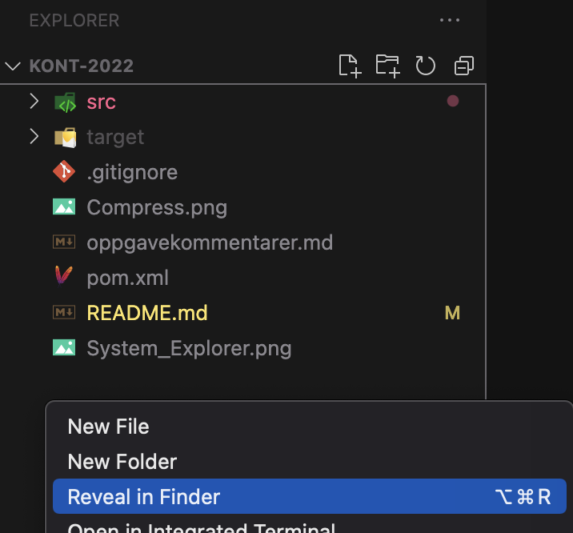

# Kont-eksamen, "sommer" 2022

Oppgåva består av følgjande delar, som ligg inne i kvar sin pakke.

-   [Del 1](src/main/java/part1/part1_nn.md)
-   [Del 2](src/main/java/part2/part2_nn.md)
-   [Del 3](src/main/java/part3/part3_nn.md)

## Oppgåveformat

Oppgåveskildringane finn dei under kvar del. Det vil seia at src/main/java/part1/part1_nn.md inneheld oppgåveskildringa for del 1.

Rolla til dei ulike klassane blir først skisserte, før sjølve oppgåveteksten.
Alle klassane er ferdig oppretta, og kan innehalda både ferdiglagde metodar og metodar dei skal fylla inn.
Det er markert med TODO-kommentarer der dei må må fylla inn eigen koda.
Evt. *return*-setningar er med for å unngå kompileringsfeil, og må òg endrast.
Merk at det kan vera nødvendig å legga til annan koda òg, avhengig av val de sjølv tar.
Nokon av klassane har main-metoder, som er meint å hjelpa dykk å testa klassane manuelt.
Ytterlegare informasjon kan stå i javadoc-en, som er kommentarar som står før klassedeklarasjonen og metodane i kjeldekoden.
Det er generelt lurt å sjå gjennom klassane for å få oversyn kva som er implementert ferdig og kva som manglar!

De kan bruka .md-filene til å navigera til riktige filer/klassar som faktisk skal implementerast.
Dersom du meiner at javadoc og oppgåveskildring inneheld motstridande informasjon, så gjer ein kommentar om dette i [oppgåvekommentarar](oppgavekommentarer.md) og
utfør oppgåva slik du meiner gir best meining.

Eit web-view av Java-docen kan og bli sett ved å opna fila doc/index.html.

Viss du ikkje skulle klara å implementera ein metode i ein del kan du sjølvsagt bruka denne vidare som om han verka (som i tidlegare 'papireksamenar').
Merk at metoden bør framleis kompilera, alle metodar kompilerer ved hjelp av _dummy_ return verdiar, som er verdiar av riktig type, men ikkje korrekte.

Kode som ikkje kompilerer vil gi trekk.

Unntak i koden som NullPointerException er ikkje kompileringsproblemer (men vil sjølvsagt ikkje gi full poengsum). De bør testa dykkar eigen kode slik at de veit at denne køyrer. For å hjelpa med dette har dei fleste delar main-metode som inneheld noko kode for å testa implementeringen. Desse main-metodene testar ikkje nødvendigvis alle tilfelle så du blir oppfordra til å utvida med dine eigne testar. Denne koden bør framleis kompilera, men treng ikkje fjernast ved levering.

## Navigering

Oppgåveskildringane kan brukast som hjelp til å navigera til riktige filer. Når du har ope ein .md-fil kan du trykka på *Preview*-ikonet for å få dette på ein meir forståeleg måte.

Alle metodane de skal fylla inn er og markerte med // TODO.
Desse kan du få ei oversyn over i VSCode med Ctrl + Shift + F (søk i heile opne mappe)

## Besvarelse
Oppgåveteksten finnast i  *partx.md*-filer og andre md-filer i prosjektet og kan lesast både på gitlab og i IDE-en. Versjon på bokmål finst også.
Oppgåva blir svart på ved å bygga vidare på kode-filene som er der, og fylla inn evt antakelser du gjer, i ein separat md-fil (oppgåvekommentarar.md)

## Nedlasting og import
Nedlasting og  _import_ skjer enten ved å lasta ned ein zip-fil frå repos-sida på gitlab eller Inspera, eller ved å klona git-reposet. 

### For Visual Studio Code
Etter at du har lasta ned zip-fil, så unzip denne. Dette gir ei mappe som heiter *kont-2022*.
Gå så inn i VSCode, og gå til File -> Open Folder. Eit filnavigeringsvindu blir opna. Finn fram til mappa du unzippet, og vel denne.
VSCode vil då, pga. POM-filen som ligg i mappa, automatisk finna ut at dette er eit Maven Java-prosjekt. (Under føresetnad at Java-utvidinga er installert i VSCode.)

### For Eclipse
Ved  _import av zip-fil_, så skal vegvisaren  *Import > Maven > Existing Maven Projects* brukast. Naviger til den nedlastede zip-filen (hugs og opne zip-filen først) og vel mappa inneheld pom.xml-fila. Ved import av zip-fil bør du og byta namn på prosjektet viss du lastar det ned på førehand, så du ikkje får konflikt med navngivning når du skal lasta ned sjølve eksamen.
Import med kloning skjer med ein annan vegvisar, som  beskrive på følgjande wiki-side:  <https://www.ntnu.no/wiki/display/tdt4100/Importere+kode+fra+git>. Lenka ein då kan klona er *https://gitlab.stud.idi.ntnu.no/tdt4100/v2022/kont-2022*.
Dersom det blir konfliktar når de *pullar* kan de høyreklikke og _Replace with > Head Revision _ på prosjektet.

## Levering
Når eksamen skal leverast kan du gjera dette på denne måten:

*Zippe i Windows*

- Høgreklikk på eit *tomt område* i 'Explorer' heilt til venstre i VSCode. Dette vil vera under 'nedste' fil i ytste mappe.
- Vel *'Reveal in File Explorer'* frå nedtrekkmenyen som dukkar opp.
- Du skal no få opp eit utforskervindu (ikkje i VSCode, men i Windows). Her skal mappa som inneheld prosjektfolderen vi skal komprimera allereie vera markerte, men dobbeltsjekk at dette stemmer.
- Høgreklikk på prosjektmappa (ho skal heita *exam* eller tilsvarande viss du har endra namn)
- Vel *'Send til' -> 'Komprimert (zippet) mappe'*.
- Windows komprimerer no prosjektmappa *exam*, og spør deg kva den skal kallast. La den heite det som blir foreslått.
- Denne zipfilen er fila de skal lasta opp til Inspera til slutt.
- De finn eit par bilde av prosessen til slutt i denne fila.

*Zippe i macOS (OS X)*

- Følg instruksjonane som for Windows overfor, men ting har andre namn.
- Høgreklikk på eit tomt område i *Explorer* heilt til venstre i VSCode og vel *'Reveal in Finder'*
- Høgreklikk prosjektmappa som no skal vera markert og vel *'Komprimer'*.
- Fila du får er den som skal lastast opp til Inspera.

Vêr nøye med at du vel riktig mappe!

### For Eclipse
*Zippe i Windows*

- Høgreklikk på prosjektikonet i 'Package Explorer' heilt til venstre i Eclipse.
- Vel 'Show in' -> click 'System Explorer'.
- Du skal no få opp eit utforskervindu (ikkje i Eclipse, men i Windows) som står ope i ein foldar som sannsynlegvis sluttar på git. For meg er det _'C:\Users\borgeha\git'_ Denne folderen inneheld prosjektfolderen vi skal komprimera.
- Høgreklikk prosjektfolderen, han skal heita kont2021 -> meny 'Send til' -> 'Komprimert (zippet) mappe'. 
- Windows komprimerer no prosjektfolderen kont2021, og spør deg kva han skal kallast La den heite det som blir foreslått.
- Denne zipfilen er fila de skal lasta opp til Inspera til slutt.
- De finn eit par bilde av prosessen til slutt i denne fila.

*Zippe i OS X*

- Følg instruksjonane som for Windows overfor, men ting har andre namn.
- Høgreklikk prosjektet i Eclipse -> 'Åpne i Finder'
- Høgreklikk prosjektfolderen og vel 'Komprimer'
- Fila du får er den som skal lastast opp til Inspera.

*System Explorer i VSCode*

*System Explorer i Eclipse*

*Komprimering av eksamensbesvarelse*

