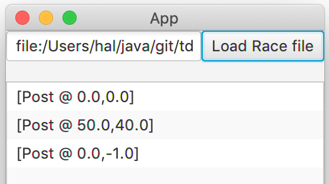
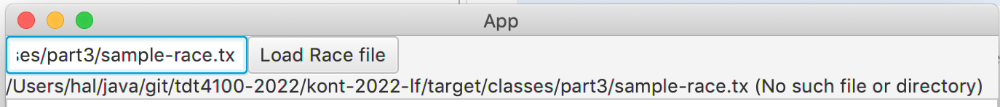

# Del 3 - Tekstformat for Race og JavaFX+FXML-app

Denne delen omhandlar lesing og skriving av eit tekstformat for Race-postar, og ein Race-app.

## Oversyn over klassane

### Raceformat

Metoder for å lesa og skriva eit tekstformat for postane i eit løp.

### RaceApp og RaceAppController

App-klasse og tilhøyrande kontroller-klasse.

## Oppgåver

### a)

Det er definert eit enkelt tekstformat for Race-postar, som kan lesa og skrivast av *Raceformat*-klassen. Skriv ferdig **readRace**- og **writeRace**-metodane i denne klassen.

### b)

Det er nesten laga ferdig ein app for å lasta inn **Race**-postar og vise postane i ei liste.
Brukaren skal kunna skriva inn ein URL (adresse til ei fil eller nettressurs) og så trykka ein knapp for å få lese inn poster vha. **Raceformat**-klassen.
Etter innlesing skal postane visast i ei liste (**Post** sin **toString**-metode blir brukt implisitt):

Dersom det blir utløyst unntak under lesing, så skal ei melding visast:

Dessverre fungerer ikkje appen, og det kan vera feil i både java- og fxml-koden.
Oppgåva er å gjera appen kjørbar, med ønskt åtferd.
